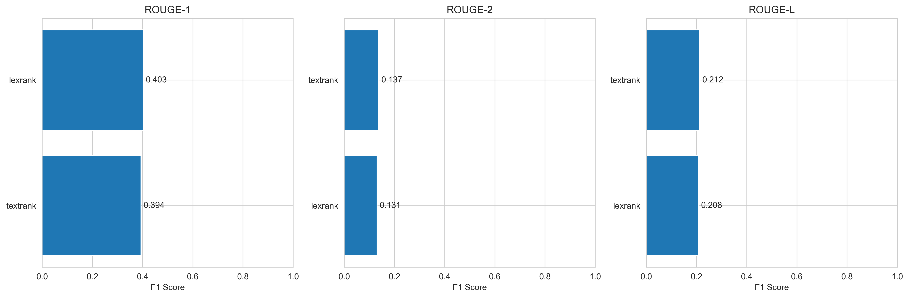
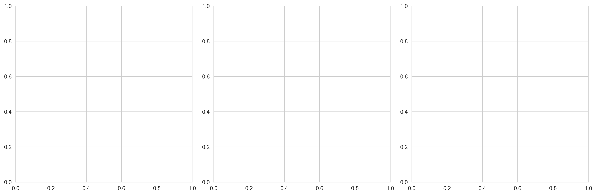
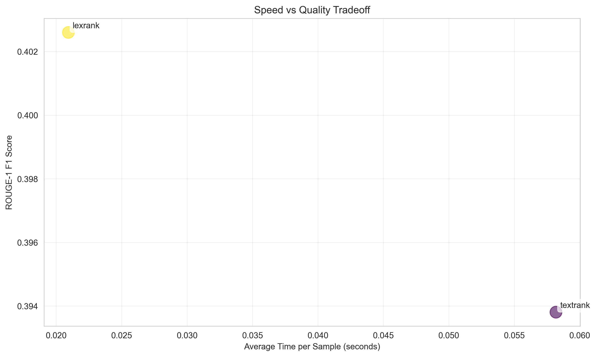

# Model Comparison Report

**Dataset:** arxiv
**Samples:** 10
**Date:** 2025-12-26 19:43

## Results Summary

### ROUGE Scores

| Model    |   ROUGE-1 |   ROUGE-2 |   ROUGE-L |
|:---------|----------:|----------:|----------:|
| textrank |    0.3938 |    0.1374 |    0.2125 |
| lexrank  |    0.4026 |    0.1313 |    0.2079 |

### Quality Metrics

| Model    |
|:---------|
| textrank |
| lexrank  |

### Performance

| Model    |   Avg Time (s) |
|:---------|---------------:|
| textrank |           0.08 |
| lexrank  |           0.04 |

## Key Findings

- **Best ROUGE-1:** lexrank (0.4026)
- **Fastest:** lexrank (0.04s)

## Approach Comparison

### Hierarchical vs Sliding Window vs Sparse Attention

## Visualizations

