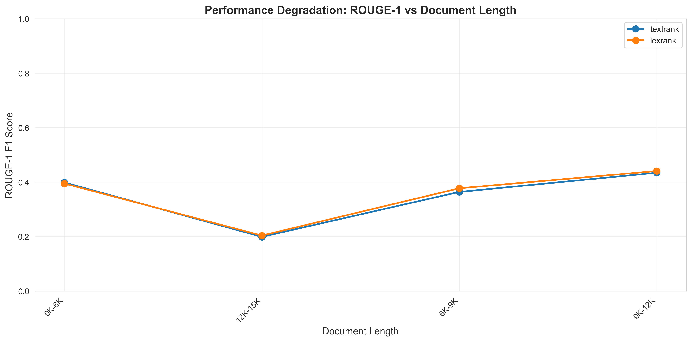
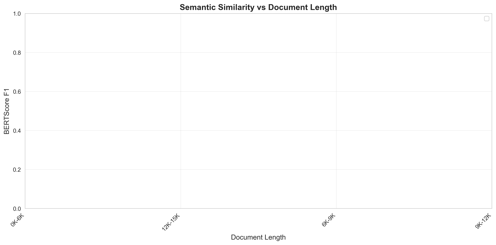
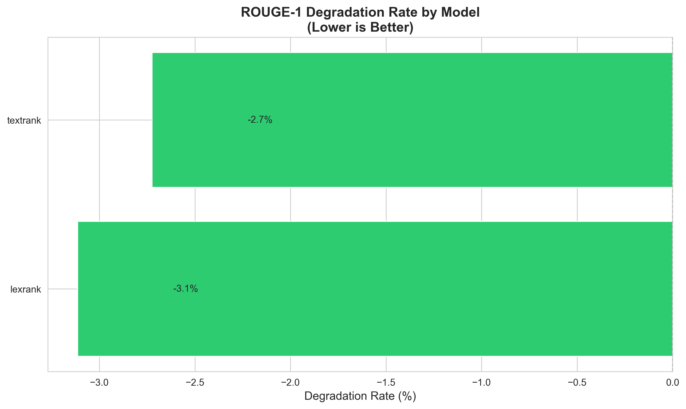
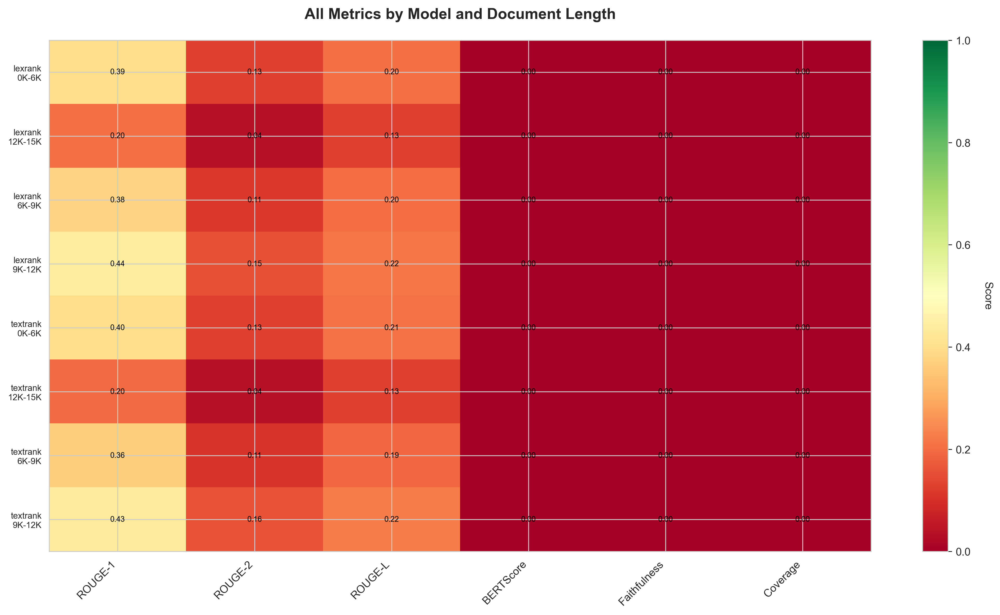

# Document Length Analysis Report

**Dataset:** arxiv
**Date:** 2025-12-25 19:41

## Overview

This report analyzes how model performance changes with document length, helping identify which approaches handle longer documents better.

## Length Bins

- **0K-6K**: 12 samples
- **12K-15K**: 12 samples
- **6K-9K**: 12 samples
- **9K-12K**: 12 samples

## ROUGE-1 Scores by Length

| Model | 0K-6K | 12K-15K | 6K-9K | 9K-12K | Degradation Rate |
|-------|-------|-------|-------|-------|------------------|
| lexrank | 0.3946 | 0.2036 | 0.3772 | 0.4405 | -3.11% |
| textrank | 0.3984 | 0.1987 | 0.3638 | 0.4342 | -2.72% |

## Key Findings

### Performance on Short Documents (0K-6K)

- **Best:** textrank (ROUGE-1: 0.3984)

### Performance on Long Documents (9K-12K)

- **Best:** lexrank (ROUGE-1: 0.4405)

### Robustness to Length

- **Most Robust:** textrank (degradation: -2.72%)
- **Most Affected:** lexrank (degradation: -3.11%)

## Approach Comparison

### Hierarchical

### Sliding Window

### Sparse Attention

## Visualizations

## Recommendations

Based on the analysis:

- **For speed-critical applications:** Extractive methods (TextRank/LexRank) are fastest but sacrifice quality on longer documents.
